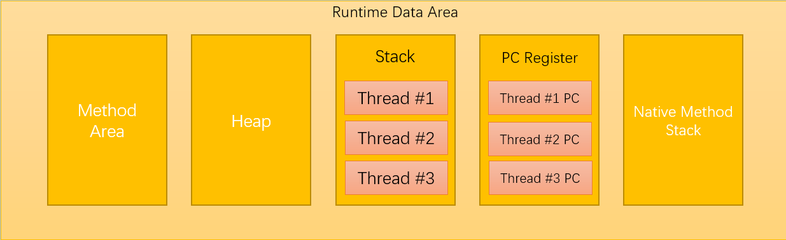
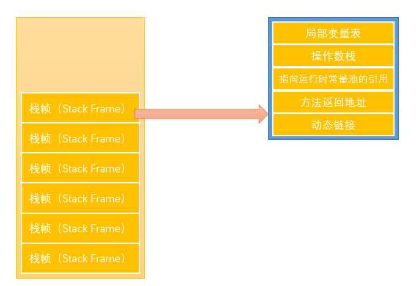
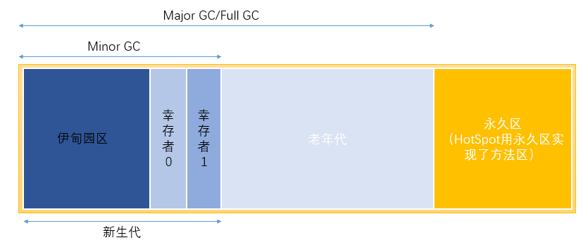

### JVM详解?me:you 2

RuntimeDataArea：包括方法区，堆区，栈区，程序计数器，本地方法栈
各区详述：
- 方法区：
	
> 方法区存放内容：由java加载器加载好的Class文件，静态的变量方法等都存到这个区域（注意final类型的变量不会存放到这个区域，每次new一个对象，final属性的变量和方法都会造一个新的出来）

- 堆区：用来存放对象的区域，此区域会出现OOM，区域大体分为2部分，新生代和老年代，新生代继续细分，具体算法下面将会描述。
- 栈区：栈区主要由栈帧组成，栈帧再次细分，如下图所示

-PC Register 程序计数器：

> 首先java是支持多线程同时执行的，所以每个线程都有一个自己的PC计数器，且在任意时刻一个java线程只会执行一个方法，该线程执行的方法叫做该线程的当前方法。如果这个方法是native的，那么PC计数器的值为undefined，如果不是，那么保存的就是当前的java虚拟机正在执行的字节码指令地址，PC计数器容量至少能够保存一个retrunAddress(java中就是通过这个类型来保存当前正在执行的指令的地址的)或者一个本地指针的值（例如undefined）。

- Stack 栈区：

首先，栈内存是由栈帧组成的

对于每个线程来说，都有一个独立的栈区，所有的局部变量等信息会存到栈中，因为栈的资源不会共享，所以栈是线程安全的

用栈帧的具体分解中可以看到，栈中保存的主要内容可以分为三大：

>  局部变量：包括基本类型变量，以及各种引用
>
> 操作数栈：操作指令
>
> 操作环境上下文

堆内存分为新生代，老年代，永久区（1.8后无永久区，被元空间替代）。

- 两种GC：

> `MinorGC` : 作用范围是新生代，利用复制算法将伊甸园区和幸存者from区的对象放入幸存者to区，清空伊甸园区以及幸存者from区，幸存者from区和幸存者to区角色互换，这样to区中的对象个数永远都是0。MinorGC每次工作，幸存者年龄加1，当幸存者年龄达到15岁，该对象会存入老年代
>
> `Major GC`：作用范围是新生代加老年代，清理所有的不再被引用的对象。利用标记清除以及标记压缩混合实现的方法对内存进行清理，此时会暂停整个程序（stop the world），以免产生新对象被直接清理掉。
>
> - 标记清除就是遍历一次，将还有引用的对象进行标记，没有人引用的对象不会被标记，第二次遍历是便会被清理出去
> - 标记压缩在标记之后不会清理，而是将存活的对象向一端压缩整理，最后一次性清理掉边界以外的内存

