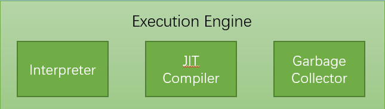

### JVM详解?me:you 1

### one：类加载器子系统的描述

首先java的四大类加载器 `(其实是三种，第四种为自定义)` ：

**以下为虚拟机自带加载器**

Bootstartp Class Loder: 启动类加载器，负责加载 **采用c++编写，故该对象值获取后为null**

Extention Class Loder: 扩展类加载器

Applicatoin Class Loder: 系统类加载器

用户自定义加载器:  Java.lang.ClassLoader的子类，用户可以定制类的加载方式

分解验证过程就是将class文件加载的过程，当然，之后就是初始化的过程（类的初始化另谈）

### two : 可以干什么

可以将一个.class文件加载初始化为一个Class，存入JVM的方法区

### three：加载的范围

Bootstartp Class Loder: $JAVAHOME/jre/lib/rt.jar 和 $JAVAHOME/jre/classes（手动创建）

Extention Class Loder: $JAVAHOME/jre/lib/ext/*.jar

Extention Class Loder: 扩展类加载器

Applicatoin Class Loder: $CLASSPATH

用户自定义加载器:  Java.lang.ClassLoader的子类，用户可以定制类的加载方式
每个加载类都会加载加载空间中的classes文件夹下的.class文件

### four：双亲委派

靠下的加载器在加载一个Class之前会想它的父加载器寻找这个Class，如果Class没有被父加载器加载过，则会继续往上找，然后从上到下尝试加载这个类，一般来说这个未出现的Class对象会通过加载的消息询问提出者来进行加载，如果上层已经加载了这个Class，下面的同样的对象将会无效，然后将Class对象存入方法区

此时.class文件完成了加载任务
字节码文件执行交由JVM执行引擎来处理

JVM执行引擎包括
Interpreter: 解释器，解释器很擅长处理字节码文件，但是如果只用解释器java的编译将会相当缓慢，原因：同一个方法调用是解释器会重复进行解析
JIT Compiler: JIT就是用来解决解释器的缓慢问题的，当JIT遇到新的字节码需要解释时需要通过解释器进行解释，将解释器解释好的内容更改为本地代码(native code)，当解析重复的方法是，直接调用本地代码
Garbage Collector: 常说的GC，对堆内存进行回收，回收机制，回收时机，回收采用的算法下面将会描述。
