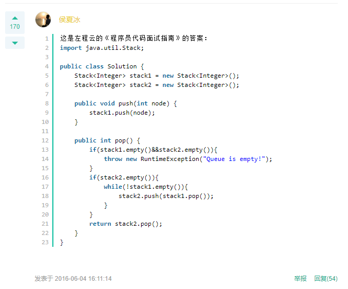

### 剑指offer

利用俩个栈实现队列：

评论区的答案



???

```java
Stack<Integer> stack1 = new Stack<Integer>();
Stack<Integer> stack2 = new Stack<Integer>();
int res = 0;

public void push(int node) {
    stack1.push(node);
}

public int pop(){
    if (stack1.empty()) throw  new RuntimeException("null");
    while (!stack1.empty()) res = stack2.push(stack1.pop());    stack2.pop();
    while (!stack2.empty()) stack1.push(stack2.pop());  return res;
}
```

疑问：

这个stack2不清空？第二次push时候怎么办，没看懂

13行对stack2判空干嘛？这个是个书有点不信的ka

最重要的是：


？？？？？？？

牛客推介答案：

```java
int pop() {
    int a;
    if(stack2.empty()){
        while(!stack1.empty()){
            a=stack1.top();
            stack2.push(a);
            stack1.pop();
        }
    }
    a=stack2.top();
    stack2.pop();
    return a;
}
```

这个top方法？
